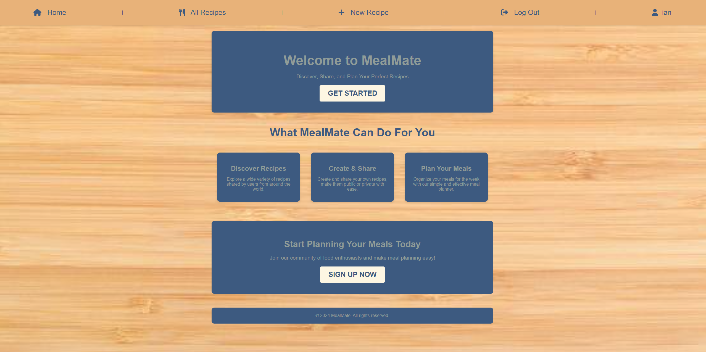

## Description

**MealMate** is a web application that allows users to share and discover recipes with a community of food lovers. Users can create profiles, upload their favorite recipes, and explore new dishes shared by others, while connecting with fellow food enthusiasts.

### Background Information

The idea for this app stemmed from my passion for cooking and the desire to create a platform where people can share recipes and find culinary inspiration. **MealMate** aims to foster a community of home cooks, chefs, and foodies who want to share their love for food and explore new dishes.

---

## Screenshot

*Here is a screenshot of the application's landing page.*

---

## Getting Started

Here's how you can use and explore the app:

- **Explore Online:** [Click here to visit **MealMate**](https://mealmatey-ac0d7c5af340.herokuapp.com/)

### Planning Materials

- https://trello.com/b/RxiVF9ZW/mealmate

---

## Attributions

- Font - [Raleway Regular](https://fonts.google.com/specimen/Raleway)

---

## Technologies Used

- **Frontend**: 
  -  
  - 
  -  
  - 
- **Backend**: 
  - 
  - 
- **Database**: 
  -  
  - Mongoose
- **Version Control**: 
  - 
  - 
- **Development Tools**: 
  - 
  - Lucid Chart
  - 
  - 
  -  

---

## Next Steps

Here are some planned features for future versions of the app:
1. **Recipe Favorite Feature**:
    - Allow users to favorite and bookmark recipes for later use.
2. **Meal Planning Tool**:
    - Create a feature where users can add recipes to a weekly meal planner.
3. **Recipe Tags & Categories**:
    - Let users add and filter by recipe tags (e.g., "quick meals," "breakfast," "holiday dishes").

